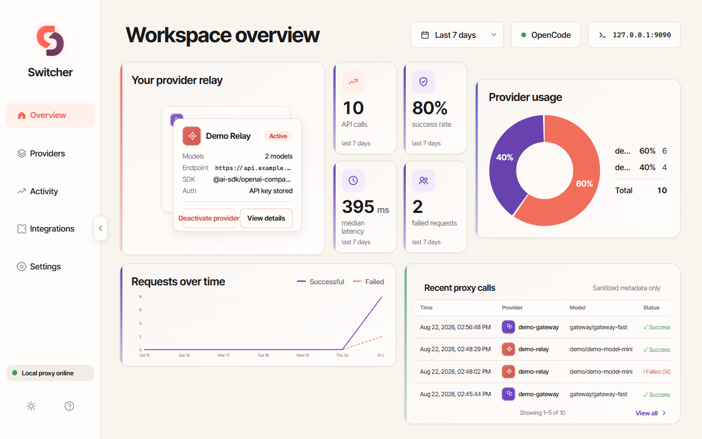
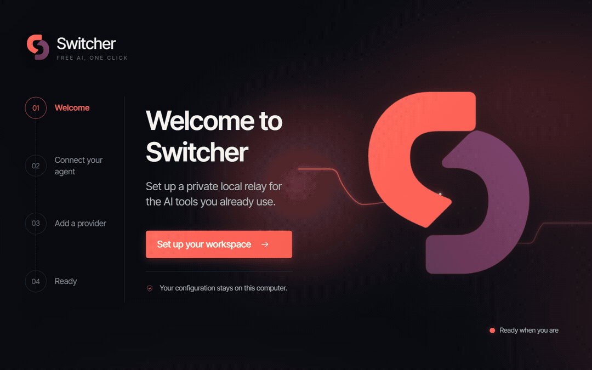
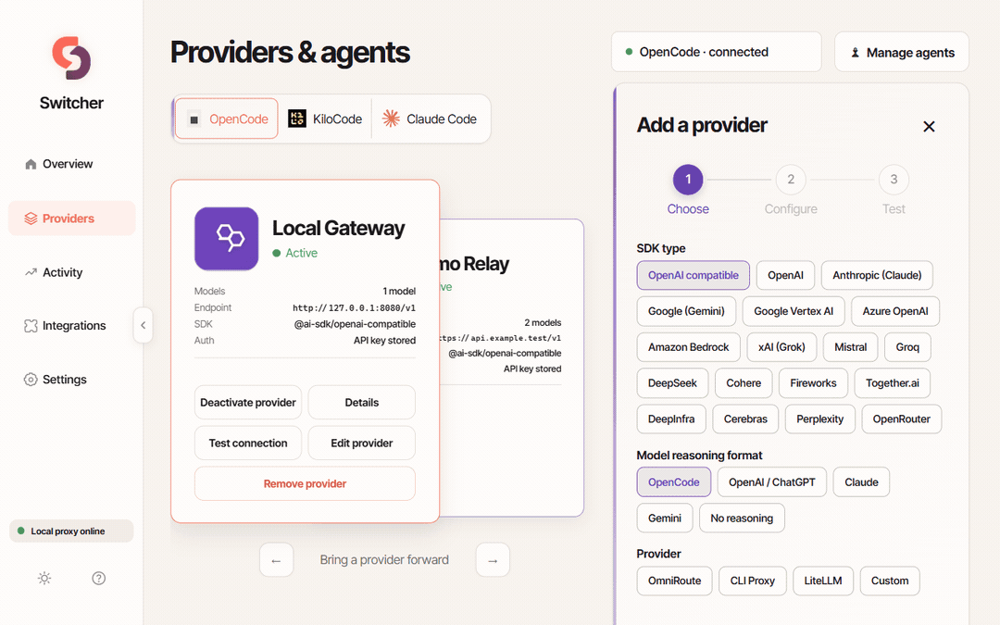
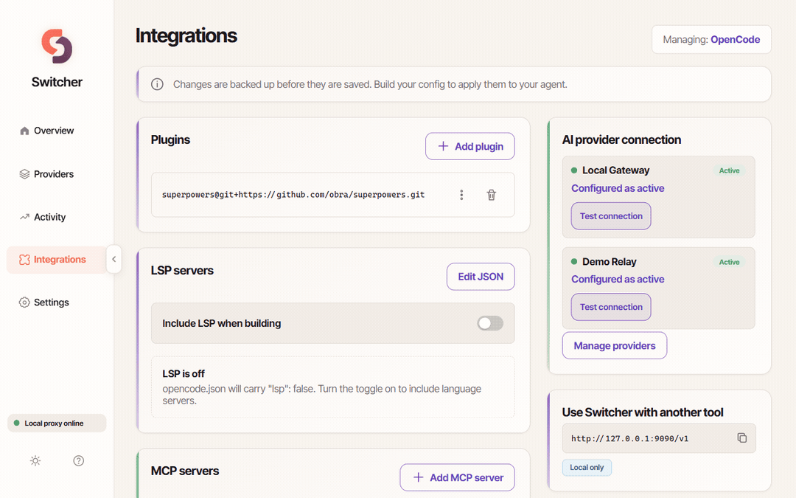
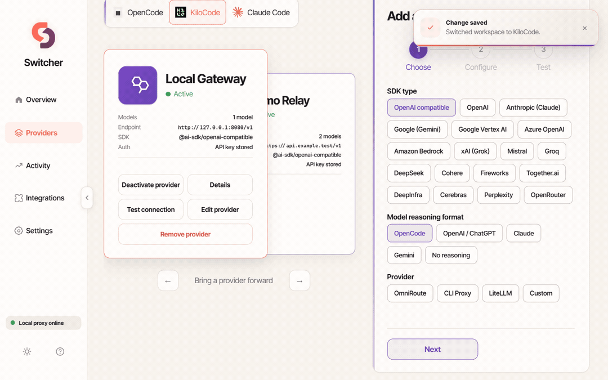
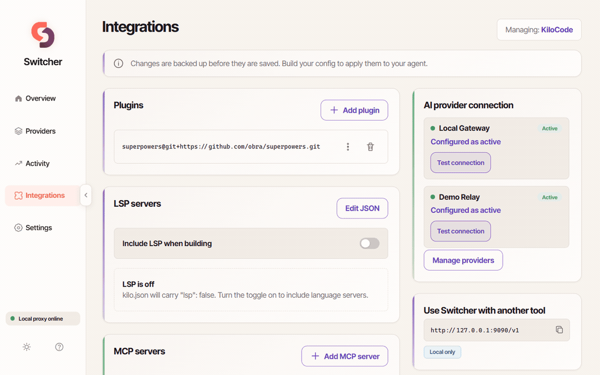
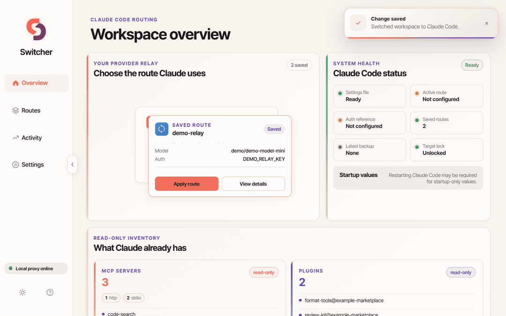
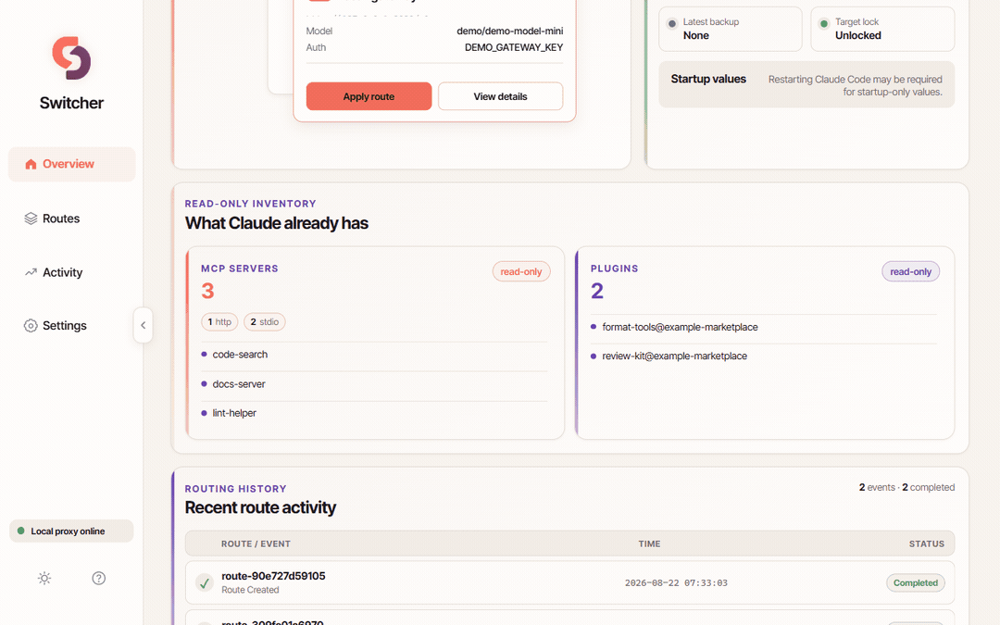

<p align="center">
  
</p>

# Switcher

> **One local switchboard for OpenCode, KiloCode, and Claude Code.**
>
> Change the provider behind your coding agent without rebuilding the same
> configuration by hand. Free. Local-first. No account, no cloud — nothing
> leaves your PC.

[](#-quick-start)
[](#-quick-start)
[](#license)
[](adapters/claude-code/README.md)

[Quick start](#-quick-start) · [See it in action](#-see-it-in-action) · [What it can do](#-what-it-can-do) · [Privacy & safety](#-privacy-and-safety) · [Docs](#-documentation--community) · [Contributing](CONTRIBUTING.md) · [Security](SECURITY.md)

---



---

## 🤔 Why Switcher exists

Every coding agent stores its AI configuration differently. OpenCode reads a
provider key from `provider.<id>.apiKey`. KiloCode reads it from
`provider.<id>.options.apiKey`. Claude Code routes through environment
variables in its own settings file. So the same question — *where should this
request go?* — gets answered in a different file format for every tool, and
switching providers means editing JSON by hand, again.

Switcher separates what you own (providers, models, profiles) from what the
agent consumes (its generated config). You manage providers once in a local
dashboard; Switcher validates everything against JSON schemas, backs up the
generated target before it writes a replacement, and runs the agent's real
builder for you. Your API tool points at `127.0.0.1:9090/v1` once — switching
where requests actually go is then one click.

It is two things sharing one engine:

- **The Switcher app** — a local Windows GUI (FastAPI + browser) that manages
  agents, providers, models, plugins, MCP servers, LSP, and builds.
- **The Builder Development Framework (BDF)** — the reusable engineering
  process and templates behind those builders, so new agent builders follow
  the same predictable pipeline instead of being improvised.

---

## 🚀 Quick start

You need **Windows 10/11** and **Python** (tick *"Add python.exe to PATH"*
during installation). Everything else ships with the repo.

### Easiest: double-click

```text
git clone https://github.com/lovkumarLED/switcher.git
cd switcher\app
```

Then run **`install.bat`** once — it creates the app's private Python
environment, installs packages (one-time, needs internet), and puts a
**Switcher** shortcut on your desktop. From now on, double-click that
shortcut (or `start.bat`). Your browser opens `http://127.0.0.1:9090` and the
setup wizard takes over. Close the window to stop the app — it is not a
background service.

### From PowerShell (verified from a fresh clone)

```powershell
git clone https://github.com/lovkumarLED/switcher.git
cd switcher\app
python -m venv env
env\Scripts\pip install -r requirements.txt
env\Scripts\python server.py
```

Only want the framework docs (`bdf/`) without the app?

```powershell
git clone --depth 1 --filter=blob:none --sparse https://github.com/lovkumarLED/switcher.git
cd switcher
git sparse-checkout set bdf
```

> All three paths were tested from a clean clone: the app-only install boots
> the full GUI, the framework-only checkout brings every `bdf/` document and
> template, and the full clone gives you both.

---

## 🎬 See it in action

All demos below run on sanitized fixture data ("Demo Relay", "Local
Gateway", example endpoints, fake keys) — never real accounts or keys. More
walkthroughs live in the [app guide](app/README.md).

| Shared | |
|---|---|
| **Onboarding wizard** — welcome → detect your installed agents → read-only review → ready |  |
| **Overview dashboard** — activity KPIs, usage split, request history |  |

### 🔀 OpenCode

Full management: providers with dual-key files, model reasoning formats,
plugins, MCP servers, LSP, and one-click build through the generated V2.7
builder.





### ⚡ KiloCode

Same engine, its own builder (KiloCode Config Builder v1.0), its own
`kilo.json` output. The app switches between managed agents instantly.





### 🧠 Claude Code

Claude Code is different, so Switcher treats it differently: a narrow routing
adapter manages exactly one route at a time (endpoint + auth reference +
model roles), credentials live in a Windows DPAPI-encrypted store (names only,
never values), and everything else Claude owns is read-only.





---

## ✨ What it can do

- 🔀 **Switch providers without reconfiguring tools.** The `/v1` proxy on
  `127.0.0.1:9090` forwards to your active provider; any OpenAI-compatible
  tool points at it once.
- 🧭 **Guided setup that scans first.** The wizard detects installed agents,
  reads their configs read-only, seeds modular profiles, and generates their
  builders — nothing changes until you approve.
- 🧩 **Integrations in one place.** Plugins, MCP servers, and an opt-in LSP
  block per profile — edited through forms or validated JSON, backed up
  before every write.
- 🧠 **Reasoning formats preserved per provider.** OpenAI/ChatGPT levels,
  Claude thinking budgets, Gemini budgets, OpenCode efforts — the correct
  JSON shape is written for whichever provider a model belongs to.
- 🛡️ **Backup-first writes.** Every change to generated targets goes to a
  backup folder first, with SHA256-hash-verified snapshot/restore used by the
  test suite.
- 🔐 **Keys stay yours.** Provider keys are written only into your own
  agent's provider files (in both places an agent may read them); Claude
  route keys live in a DPAPI-encrypted store referenced by name only.
- 📊 **Honest local observability.** Activity pages show metadata only —
  timestamps, statuses, latency, token counts. Prompts, responses, and
  headers are never stored, and redaction cannot be turned off.

| Capability | OpenCode | KiloCode | Claude Code |
|---|---|---|---|
| Provider/model configuration | ✅ full CRUD + presets | ✅ full CRUD + presets | Route-oriented (one scalar route) |
| Generated builder flow | `build-opencode.ps1` (V2.7 engine) | `build-kilo.ps1` (K1 engine) | Dedicated routing adapter ([docs](adapters/claude-code/README.md)) |
| Plugins / MCP / LSP | Manageable | Manageable | Read-only inventory |
| Credential storage | In your provider files (dual-key) | In your provider files (dual-key) | Windows DPAPI store, names only |
| Status | Verified end-to-end | Verified end-to-end | Live validated (2026-08-17) |

---

## 🔐 Privacy and safety

- **Local-only.** The server binds `127.0.0.1` only. No account, no phone-home.
- **Your files stay the source of truth.** Providers and profiles live inside
  your agent's own config folder — the app never keeps a private copy.
- **Generated files are outputs.** Never hand-edit `opencode.json` /
  `kilo.json`; edit sources in the app (or builder) and rebuild.
- **Backup before write.** Every write is copied to the agent's `backup\`
  folder first.
- **No secrets anywhere else.** Keys never appear in code, logs, examples, or
  API responses (the app returns "has key" booleans, never values).
- **The `.jsonc` hard rule:** the framework only ever scans the main `.json`.
  It never reads or writes any `.jsonc` — and you shouldn't create one next
  to your generated config: OpenCode would read the `.jsonc` *instead*, and
  your built config silently disappears from `/models`.

---

## 🏗️ Architecture, in one look

```text
Provider + profile sources (yours, inside your agent's folder)
          │
          ▼
   Switcher app / BDF builder
   validate → backup → merge
          │
          ▼
  Generated agent config        Local proxy 127.0.0.1:9090/v1
  (opencode.json / kilo.json /      └─ forwards to the active
   Claude env route patch)           provider for any OpenAI-compatible tool
```

Deep details live in dedicated documents:

- [ARCHITECTURE.md](ARCHITECTURE.md) — system structure and module map
- [BUILDER_SPEC.md](BUILDER_SPEC.md) — the exact builder pipeline
- [JSON_SCHEMAS.md](JSON_SCHEMAS.md) — every source file's schema
- [adapters/claude-code/README.md](adapters/claude-code/README.md) — the Claude
  Code routing adapter: scope, ownership boundaries, evidence gates

---

## 📖 Why I built this

It started with a pretty simple problem: **too many API keys, too many
providers, and configuration files that kept growing.** 😅

I'm just a normal guy trying to learn **Python and Machine Learning** —
intermediate Python so far, still working my way toward the ML part of the
journey. To learn without spending a fortune, I hunted down every free model
and free API I could find. Different providers, different coding agents,
different websites — anything that gave me more useful AI tools.

And it worked. Maybe too well.

Before long I had a drawer full of API keys, provider files, model lists, MCP
servers, plugins, and profiles. My JSON configs were getting bigger and
bigger — and the real kicker is that **every agent reads them differently**.
One provider file, two contracts. And a stray `opencode.jsonc` can silently
shadow the config you just spent an hour building.

At some point I thought:

> **"There has to be a better way to manage all of this."**

So I built one.

I didn't know how to build any of this when I started. I know Python, but I
had never built a web app, and the builders are PowerShell — a language I
didn't speak at all. So I built them with the help of **coding agents**, one
experiment at a time: days of debugging, breaking things, fixing them, and
slowly figuring out how the pieces fit together. That's what made it fun.

A narrow Claude Code routing adapter is now **live validated** (see
[adapters/claude-code/](adapters/claude-code/README.md)) — it manages one
scalar route at a time and preserves everything Claude owns.

I'm not finished. More agents and more providers are on the list. But right
now, this is the system I built because I actually needed it — and if you
like it, you're welcome to contribute. That would make me genuinely happy. ❤️

### 😄 One Last Thing...

If you ever wonder why the generated JSON files — `kilo.json`,
`opencode.json` — look completely cursed after running a builder...

**Just press `Shift + Alt + F`.**

You're welcome. 😂

---

## 🧭 Project status

Current release: **2.5.3** (Builder V2.7 + LSP support; Claude Code routing
adapter live validated). The universal builder generator (BDF V3) is in
progress; more coding agents are planned — **Pi** is next in line. Details:
[ROADMAP.md](ROADMAP.md) · [CHANGELOG.md](CHANGELOG.md).

---

## 📚 Documentation & community

| Area | Start here |
|---|---|
| Using the app (screens, workflows, troubleshooting) | [app/README.md](app/README.md) |
| The BDF framework (process, templates, lifecycle) | [bdf/README.md](bdf/README.md) |
| Claude Code adapter (scope + evidence) | [adapters/claude-code/README.md](adapters/claude-code/README.md) |
| Architecture / schemas / testing | [ARCHITECTURE.md](ARCHITECTURE.md) · [JSON_SCHEMAS.md](JSON_SCHEMAS.md) · [TESTING.md](TESTING.md) |
| Troubleshooting | [TROUBLESHOOTING.md](TROUBLESHOOTING.md) |
| Contributing | [CONTRIBUTING.md](CONTRIBUTING.md) |
| Security policy | [SECURITY.md](SECURITY.md) |
| Code of conduct | [CODE_OF_CONDUCT.md](CODE_OF_CONDUCT.md) |
| License | [LICENSE](LICENSE) |

Switcher is MIT licensed © Lov Kumar — see [LICENSE](LICENSE). The name
"Switcher", "Builder Development Framework", "BDF", the logo artwork, and the
demo media are not part of the MIT grant: use the code freely, but don't
re-publish the project under another name or reuse its branding without
permission.

---

**Version:** 2.5.3 · **Builder Version:** V2.7 (JSON Schema Validation) ·
**Framework Version:** 2.3.0

*Thanks for reading. If this helps one more person learn AI the free way like
it helped me — that's the whole point.* ❤️
